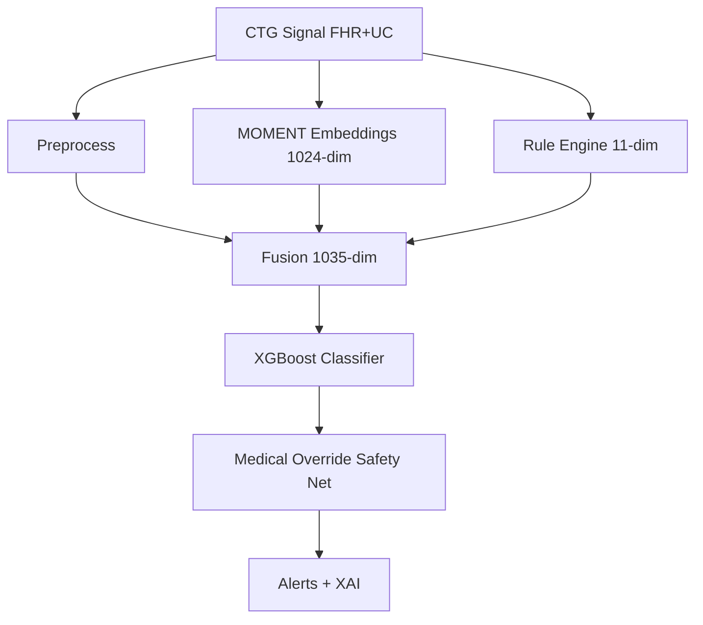

# SentinelFetal Gen3.5

[](https://opensource.org/licenses/MIT)
[](https://www.python.org/downloads/)
[](https://streamlit.io/)

**Hybrid AI System for Fetal Monitoring** combining MOMENT foundation model with rule-based engine based on the Israeli Position Paper on CTG Interpretation.

---

## 🎯 Overview

SentinelFetal Gen3.5 is a real-time fetal distress detection system that uses a **Dual Feature Extraction** approach:

1. **MOMENT Model** (AutonLab/MOMENT-1-large): 385M parameter foundation model for zero-shot time series embeddings (1024-dim)
2. **Rule Engine**: Clinical rules from Israeli Position Paper detecting baseline, variability, decelerations, tachysystole, and sinusoidal patterns

The system classifies CTG recordings into three medical categories:
- **Category 1 (Normal)**: Green light - Normal fetal status
- **Category 2 (Intermediate)**: Orange light - Requires close monitoring
- **Category 3 (Pathological)**: Red light - Immediate intervention required

---

## 🏗️ Architecture



- **Safety Net:** Medical overrides enforce critical findings (sinusoidal → Cat 3; brady/recurrent lates → Cat 2 safety floor) regardless of ML output.

---

## 📦 Installation & Setup

```bash
# Clone repository
git clone https://github.com/ArielShamay/SentinelFetal.git
cd SentinelFetal

# Create virtual environment
python -m venv .venv
.\.venv\Scripts\activate   # Windows PowerShell
# Or: source .venv/bin/activate  # Linux/macOS

# Install dependencies
pip install -r requirements.txt

# Set PYTHONPATH
$env:PYTHONPATH = "."  # Windows PowerShell
# Or: export PYTHONPATH=.  # Linux/macOS

# Verify environment
python scripts/verify_system.py

# Run tests
pytest tests/
```

---

## 🚀 How to Run

| Task | Command |
|------|---------|
| **Simulation Dashboard** (8-patient real-time) | `python scripts/run_simulation.py` |
| **Main Dashboard** (analysis/plots) | `streamlit run src/ui/app.py` |
| **Verify Environment** | `python scripts/verify_system.py` |
| **Run Tests** | `pytest tests/ -v` |

---

## 📊 Dataset

Uses the **CTU-UHB Intrapartum Cardiotocography Database** from PhysioNet:
- 552 intrapartum recordings
- Sampling rate: 4 Hz
- Signals: FHR1, FHR2, UC

Download from: https://physionet.org/content/ctu-uhb-ctgdb/1.0.0/

---

## 📂 Project Structure

```
SentinelFetal/
├── src/
│   ├── pipeline/          # DI container + AnalysisPipeline
│   ├── analysis/          # Alerts, overrides
│   ├── rules/             # Baseline, variability, decels, sinusoidal
│   ├── simulation/        # Orchestrator, generators, events
│   ├── models/            # MOMENT encoder, XGBoost wrapper
│   ├── ui/                # Streamlit apps
│   └── utils/             # Signal utilities
├── scripts/               # run_simulation.py, verify_system.py
├── tests/                 # Unit + integration + benchmarks
├── docs/
│   └── reports/           # Benchmark & evaluation reports
├── archive/docs/          # Superseded specs & PRDs
├── models/                # Saved demo model + config
└── data/                  # CTU-UHB database
```

---

## 📚 Documentation

| Document | Description |
|----------|-------------|
| **[SENTINEL_FETAL_MASTER_DOC.md](SENTINEL_FETAL_MASTER_DOC.md)** | Full technical manual & API reference |
| **[DEMO_CHEAT_SHEET.md](DEMO_CHEAT_SHEET.md)** | Quick demo commands |
| **[DEMO_SCRIPT.md](DEMO_SCRIPT.md)** | Full demo walkthrough |

### Benchmark Reports

| Report | Phase | Description |
|--------|-------|-------------|
| [COMPREHENSIVE_EVALUATION_REPORT.md](docs/reports/COMPREHENSIVE_EVALUATION_REPORT.md) | Phase 8 | Accuracy & load benchmarks |
| [hourly_simulation_summary.md](docs/reports/hourly_simulation_summary.md) | Phase 9 | 4-patient batch simulation |
| [ENDURANCE_TEST_REPORT.md](docs/reports/ENDURANCE_TEST_REPORT.md) | Phase 10 | 1-hour real-time stability |
| [ROBUSTNESS_TEST_REPORT.md](docs/reports/ROBUSTNESS_TEST_REPORT.md) | Phase 11 | Noise/dropout/artifact torture test |
| [MASSIVE_ROBUSTNESS_REPORT.md](docs/reports/MASSIVE_ROBUSTNESS_REPORT.md) | Phase 13 | 500-scenario massive scale stress test (64% detection) |

### Archived Specs (reference only)

Located in `archive/docs/`:
- SentinelFetal_PRD.docx.txt
- SentinelFetal_TechSpec.docx.txt
- SentinelFetal_Gen35_Spec.docx.txt
- SentinelFetal_RealTimeSimulator_SPEC_Part1.md / Part2.md
- DEVELOPMENT_PLAN.md

---

## 🔬 Clinical Rules (Israeli Position Paper)

### Baseline FHR
- **Normal**: 110-160 bpm
- **Bradycardia**: <110 bpm
- **Tachycardia**: >160 bpm

### Variability
- **Absent**: 0-2 bpm (Category 3 if >50 min)
- **Minimal**: 3-5 bpm (Category 2)
- **Moderate**: 6-25 bpm (Normal)
- **Marked**: >25 bpm

### Decelerations
- **Early**: <5 s lag (benign)
- **Late**: >15 s lag (concerning)
- **Variable**: Abrupt onset

### Tachysystole
- >5 contractions per 10 minutes (averaged over 30 min)

### Sinusoidal Pattern ⚠️
- **SEVERE FINDING** - Always Category 3
- Frequency: 3-5 cycles/min, amplitude 5-15 bpm, >20 min duration

---

## 📈 Development Phases

- [x] Phase 1-2: Data Pipeline + Rule Engine
- [x] Phase 3-4: MOMENT Integration + Hybrid Classifier
- [x] Phase 5-7: Real-time Simulation + Dashboards
- [x] Phase 8: Comprehensive Evaluation
- [x] Phase 9: Hourly Batch Simulation
- [x] Phase 10: Endurance (1-hr stability)
- [x] Phase 11: Robustness Torture Test + Doc Cleanup
- [x] Phase 12: Massive Scale Robustness (500 scenarios, 59.8% detection, 0% false positives)
- [x] Phase 13: Signal Processing Upgrade (Savitzky-Golay filter, 64.0% detection, 0% FP, sinusoidal 100%)

---

## 📄 License

This project is licensed under the MIT License - see the [LICENSE](LICENSE) file for details.

---

## 📚 References

- **Israeli Position Paper on CTG Interpretation** (Ministry of Health, Israel)
- **MOMENT Model**: [AutonLab/MOMENT](https://huggingface.co/AutonLab/MOMENT-1-large)
- **CTU-UHB Database**: [PhysioNet](https://physionet.org/content/ctu-uhb-ctgdb/1.0.0/)
- **NICHD Guidelines**: National Institute of Child Health and Human Development

---

## 👨‍💻 Author

**Ariel Shamay** - [@ArielShamay](https://github.com/ArielShamay)
